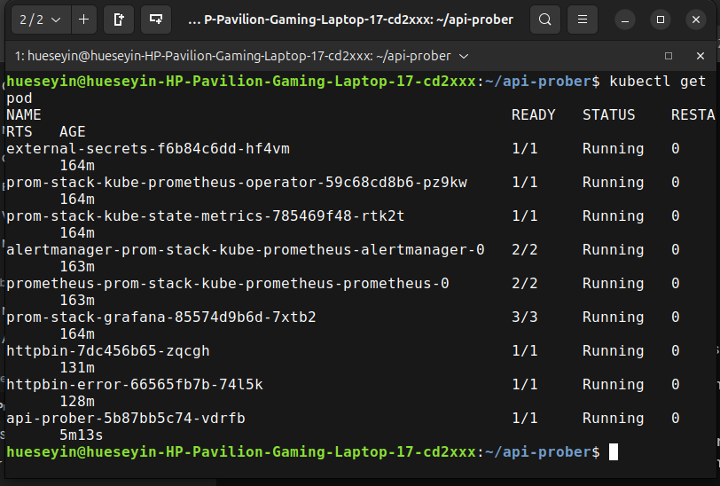
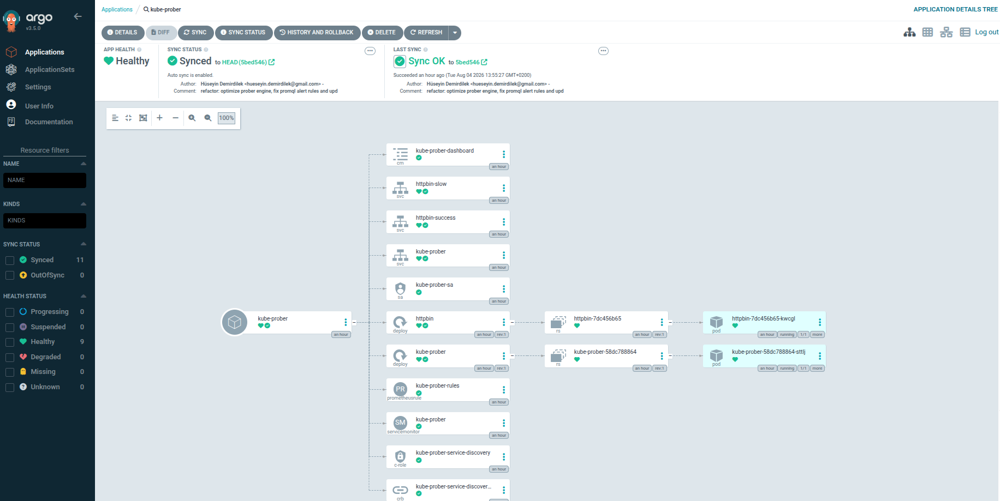
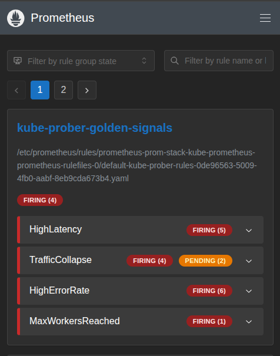
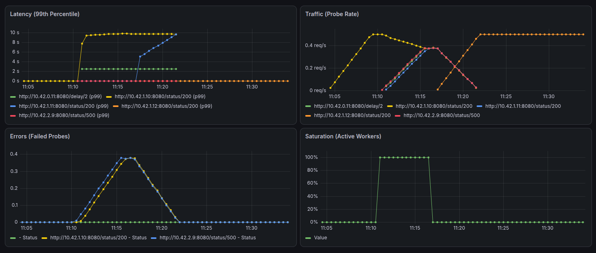
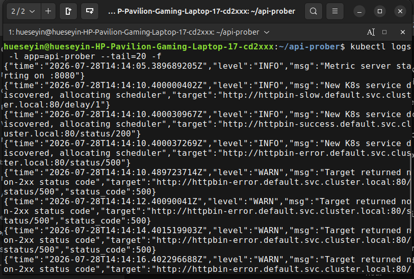
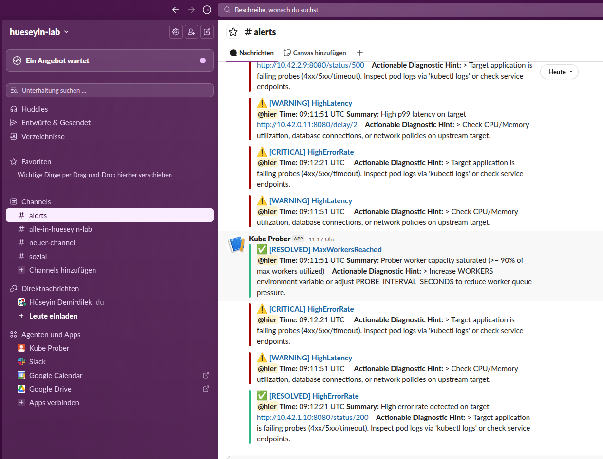
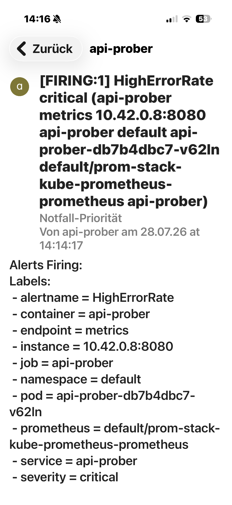
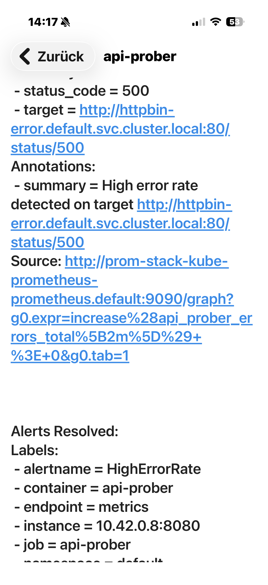

# kube-prober

[](https://github.com/demirdilek/kube-prober/actions/workflows/ci.yml)
[](https://opensource.org/licenses/MIT)
[](https://github.com/demirdilek/kube-prober)
[](https://github.com/demirdilek/kube-prober/pkgs/container/kube-prober)

`kube-prober` is a lightweight Kubernetes-native probing controller written in Go. It dynamically discovers endpoints via Kubernetes `EndpointSlices` using a `SharedInformer` and performs health and performance probes using a concurrency-safe worker pool. Metrics (4 Golden Signals) and lifecycle endpoints are exposed for Prometheus integration.

---

## 📦 Container Image Specs

- **Registry:** `ghcr.io/demirdilek/kube-prober:latest`
- **Base Image:** `scratch` (Minimalist & secure zero-OS runtime)
- **Architecture:** Multi-Arch (`amd64` / `arm64`)

---

## Key Features

- **Event-Driven K8s Target Discovery:** Replaces high-overhead API polling with modern `discoveryv1.EndpointSlice` Kubernetes Informers.
  - Monitored endpoints are filtered by the Service label `probe: "true"`.
  - Custom paths can be annotated via `probe/path: "/healthz"`.
- **Dynamic K8s Targets:** Monitored endpoints are dynamically discovered via Kubernetes API labels (`probe=true`) and custom path annotations (`probe/path="/healthz"`).
- **6-Tier SRE Error Classification:** Categorizes failures into discrete buckets: `dns_error`, `connection_refused`, `tls_error`, `timeout`, `http_error` (4xx/5xx), and `unknown_error`.
- **Actionable SRE Diagnostic Hints:** Error metrics and alerts automatically carry context-aware recovery steps (`hint`) for all 6 failure categories (e.g., DNS, TLS, Timeout, HTTP 5xx), significantly lowering Mean Time To Recovery (MTTR) for on-call engineers.
- **Dynamic Alertmanager Routing:** Clean, non-empty alert notifications dynamically formatted for both Slack ChatOps and high-priority Pushover mobile push notifications.
- **GitOps Continuous Delivery:** Fully automated deployment, sync, and self-healing managed declaratively via Argo CD.
- **Declarative Telemetry Stack:** Pre-configured Prometheus monitoring, Grafana sidecars, and Alertmanager routing via `prom-stack-values.yaml`.
- **Graceful Shutdown:** Listens for termination signals (`SIGINT`, `SIGTERM`) to cleanly shut down without dropping in-flight probes.
- **Multi-Channel Alert Routing:** Dynamic Alertmanager routing featuring dual-channel notification delivery:
  - **Slack:** Full audit trail and ChatOps visibility for all alert states (`warning`, `critical`, `RESOLVED`).
  - **Pushover:** High-priority mobile push notifications (bypassing hardware silent switches via Priority 1) for `critical` incidents.

---

## Tech Stack & Architecture

- **Go (Golang):** Core microservice architecture featuring native API probing and Prometheus instrumentation.
- **Kubernetes:** Event-driven target discovery utilizing modern `discoveryv1.EndpointSlice` Kubernetes Informers.
- **Argo CD:** GitOps controller executing continuous delivery and automated cluster state synchronization.
- **Prometheus & Grafana:** Full observability stack measuring the 4 Golden Signals.
- **Alertmanager:** Production-ready alert routing with severity classification (`warning`, `critical`).

---

## Architecture Overview

The `kube-prober` microservice acts as the central observability engine. Using a Kubernetes Informer, it streams target changes directly from the API server into a local, thread-safe memory registry before executing HTTP/DNS probes and exporting 4 Golden Signals telemetry.

```text
[ K8s Control Plane ] --(EndpointSlice Watch Stream)--> [ kube-prober Informer ]
                                                                 |
                                                    (Thread-Safe Local Registry)
                                                                 |
                                                    (Concurrent HTTP/DNS Probes)
                                                                 v
                                                        [ Target Services ]
                                                                 |
                                                        (Prometheus Metrics)
                                                                 v
                                                           [ Prometheus ]
                                                                 |
                                                            (Alert Rules)
                                                                 v
                                                           [ Alertmanager ]
                                                                 |
                                                      (Webhooks / Slack / Push)
                                                                 v
                                                           [ SRE On-Call ]
```

---

## Project Structure

```text
.
├── .github/
│   └── workflows/          # GitHub Actions CI & Docker Build Pipelines
├── assets/                 # Documentation Screenshots
├── deploy/
│   └── argocd/             # Argo CD Application Manifests (GitOps)
├── helm/
│   └── kube-prober/         # Custom Helm Chart (Deployment, RBAC, ServiceMonitor, Dashboard)
│       ├── dashboards/     # Auto-provisioned Grafana Dashboards
│       └── templates/      # K8s Resources & Alerting Rules
├── pkg/
│   └── prober/             # Core HTTP Probing Engine, K8s EndpointSlice Informers & Metrics
│   └── server/             # Health, Readiness, Pprof & Metrics HTTP Server
├── Dockerfile              # Multi-stage, Multi-arch Build File
├── Makefile                # Complete Lifecycle Automation (k3d, Argo CD, Helm)
├── main.go                 # Entry Point & Dynamic K8s Service Watcher
├── main_test.go            # Unit and Integration Tests
└── prom-stack-values.yaml  # Prometheus Stack & Alertmanager Routing Config
```

---

## Getting Started

### Prerequisites

- Docker / Buildx
- k3d / Kubernetes
- Helm 3+
- GNU Make

---

## Local Cluster Lifecycle & Deployment

You can manage the local development cluster and the entire stack lifecycle using the provided `Makefile`:

```bash
# Spin up the entire stack from scratch (k3d, Docker build, Prometheus, Argo CD, Helm deployment)
make all

# Fast local rebuild, import, pause GitOps auto-sync, and rollout restart for local debugging
make local-deploy

# Pause Argo CD Auto-Sync & Self-Healing for local debugging
make dev-enable

# Re-enable Argo CD Auto-Sync & Self-Healing
make dev-disable

# Delete local k3d cluster and clean up local artifacts
make clean

# Start background port-forwarding for Argo CD (8080), Prometheus (9090), and Grafana (3000)
make forward-all

# Stop background port-forwarding
make stop-forward

# Run unit and integration tests with the race detector enabled
make test
```



---

## Observability & Dashboards

The Grafana dashboard is **fully auto-provisioned out of the box** via the Prometheus Operator sidecar mechanism (`grafana_dashboard: "1"`), requiring zero manual JSON imports or configuration. It visualizes real-time telemetry for all 4 Golden Signals: Latency, Traffic, Errors, and Saturation.

Once background port-forwarding is active (`make forward-all`), access the Control Plane UIs via your browser or Tailscale network:

- **Argo CD:** [https://localhost:8080](https://localhost:8080) or [https://<TAILSCALE_IP>:8080](https://<TAILSCALE_IP>:8080)
- **Prometheus:** [http://localhost:9090](http://localhost:9090) or [http://<TAILSCALE_IP>:9090](http://<TAILSCALE_IP>:9090)
- **Grafana:** [http://localhost:3000](http://localhost:3000) or [http://<TAILSCALE_IP>:3000](http://<TAILSCALE_IP>:3000)

| Argo CD Control Plane | Prometheus Target Telemetry |
| :---: | :---: |
|  |  |

| Grafana 4 Golden Signals Dashboard | Structured Slog Output |
| :---: | :---: |
|  |  |

---

## Alerting & Escalation

Real-time telemetry evaluation is managed via Prometheus Alertmanager based on defined thresholds for the 4 Golden Signals. Alerts are pre-classified by severity (`warning` vs. `critical`) and can be seamlessly routed to Webhooks, PagerDuty, Opsgenie, or Slack.

### Simulating Alerts

The setup allows you to simulate threshold violations for different Golden Signals out of the box:

#### 1. High Latency Alert

The Helm chart automatically provisions a target called `httpbin-slow` which simulates delayed responses (`/delay/1`). Once Prometheus evaluates the high p99 latency threshold over the defined timeframe, Alertmanager triggers the `HighLatency` rule.

#### 2. High Error Rate Alert (Dynamic Discovery & Error Target Simulation)

You can trigger a real-time HTTP 500 error alert using the Makefile.
Deploy an artificial error target with the required `probe: "true"` label:

```bash
# Deploy an artificial error target (HTTP 500)
make test-alert

# Clean up the error target after testing
make test-alert-clean
```

The Go engine will dynamically discover the new endpoint instantly via its event-driven Kubernetes Informer stream and start probing it. Shortly after, the `HighErrorRate` rule fires in Prometheus and escalates to Alertmanager.

### Multi-Channel Alert Routing Matrix

| Slack Audit Trail (`#alerts`) | Pushover Lockscreen Alert | Pushover Detailed View |
| :---: | :---: | :---: |
|  |  |  |

### Roadmap & Production Readiness

Check out our [ROADMAP.md](ROADMAP.md) for planned features, upcoming architectural refinements, and production readiness milestones.
