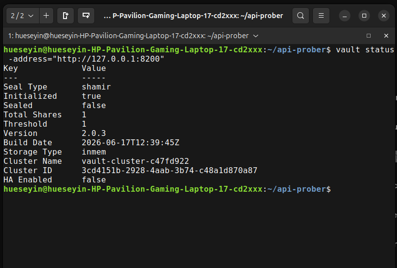

# api-prober

[](https://github.com/demirdilek/api-prober/actions/workflows/ci.yml)
[](https://opensource.org/licenses/MIT)

A cloud-native, platform-independent SRE telemetry stack written in Go. This project implements and visualizes the **4 Golden Signals** (Latency, Traffic, Errors, Saturation) for distributed edge environments.

## Features

* **Dynamic Targets:** Monitored endpoints are dynamically discovered via Kubernetes API annotations (`probe=true`). A native background watcher applies updates on the fly without requiring application restarts.
* **Enterprise Secret Management:** Fully decoupled credential management using HashiCorp Vault and External Secrets Operator (ESO). Secrets are injected as secure file mounts, preventing environment variable leaks.
* **Configuration as Code:** The entire Prometheus monitoring stack is configured declaratively via `prom-stack-values.yaml`, preparing the project for GitOps workflows.
* **Fully Encapsulated Stack:** Self-contained environment featuring Go, Prometheus, Alertmanager, Grafana, HashiCorp Vault, and Httpbin.
* **Multi-Stage & Multi-Arch Build:** Minimal Docker footprint supporting both `amd64` and `arm64` architectures.
* **Graceful Shutdown:** Listens for termination signals (`SIGINT`, `SIGTERM`) to cleanly shut down without dropping in-flight probes.

## Tech Stack & Architecture

* **Go (Golang):** Core microservice architecture featuring native API probing and Prometheus instrumentation.
* **Kubernetes:** Dynamic service discovery utilizing Kubernetes API annotations.
* **HashiCorp Vault:** Centralized and secure secrets management for sensitive credentials.
* **External Secrets Operator (ESO):** Automated synchronization of secrets from HashiCorp Vault into native Kubernetes Secrets.
* **Prometheus & Grafana:** Full observability stack measuring the 4 Golden Signals.
* **Alertmanager & Pushover:** Real-time mobile alert notifications triggered by defined threshold violations.

> **Secret Management Flow:**  
> Sensitive credentials (e.g., Pushover User Key and App Token) are stored securely in HashiCorp Vault and synced directly into Kubernetes Secrets via the External Secrets Operator (ESO).

### Vault Operational Status

Verify that HashiCorp Vault is initialized and unsealed:



## Getting Started

### Prerequisites

* Docker
* k3d / Kubernetes
* Helm
* GNU Make
* HashiCorp Vault (runs locally in dev mode via Docker; no local CLI installation required)

## Local Cluster Lifecycle & Deployment

### You can manage the local development cluster and the entire stack lifecycle using the provided Makefile

```bash
# Spin up the entire stack from scratch (k3d, Vault, Docker build, ESO, Prometheus, Helm deployment)
make all

# Start background port-forwarding for Prometheus and Grafana
make forward-all

# Run unit and integration tests with the race detector enabled
make test
```


## Observability & Dashboards

The Grafana dashboard is **fully auto-provisioned out of the box** via the Prometheus Operator sidecar mechanism (`grafana_dashboard: "1"`), requiring zero manual JSON imports or configuration. It visualizes real-time telemetry for all 4 Golden Signals: Latency, Traffic, Errors, and Saturation.

Once port-forwarding is active (`make forward-all`), access Grafana at `http://localhost:3000`. The default home screen is automatically configured to display the 4 Golden Signals.

Once port-forwarding is active, access Grafana at  <http://localhost:3000>  The login credentials will be printed in your terminal by the Makefile.


## Alerting & Escalation

Real-time notifications are managed via Prometheus Alertmanager based on thresholds of the 4 Golden Signals.


### Emergency Priority (iOS Silent Mode Bypass)

Alerts are pre-configured to escalate critical issues. To ensure critical operational alerts break through your phone's silent switch or "Do Not Disturb" focus modes:

* Open Settings on your iOS device.
* Navigate to Pushover -> Notifications.
* Enable Allow Critical Alerts.

| Notification 1 | Notification 2 |
| :---: | :---: |
|  |  |

## Simulating Alerts

The setup allows you to simulate alerts for different Golden Signals:

### 1. High Latency Alert

The Helm chart automatically provisions a target called `httpbin-slow` which simulates delayed responses (`/delay/1`). Once Prometheus evaluates the high p99 latency threshold over the defined timeframe, Alertmanager will push a notification to your configured Pushover device.

### 2. High Error Rate Alert (Dynamic Discovery)

You can test the dynamic service discovery and error alerting by creating a custom target that returns HTTP 500 errors.

Simply deploy a service with the `probe="true"` label and the `probe/path="/status/500"` annotation:

```bash
kubectl apply -f - <<EOF
apiVersion: v1
kind: Service
metadata:
  name: httpbin-error
  labels:
    app: httpbin
    probe: "true"
  annotations:
    probe/path: "/status/500"
spec:
  ports:
    - port: 80
      targetPort: 8080
  selector:
    app: httpbin
EOF
```

The Go engine will dynamically pick up the new endpoint within 5 seconds and start probing it. Shortly after, the HighErrorRate rule will fire in Prometheus and escalate to Alertmanager.

To clean up and remove the failing endpoint once tested:

```bash
kubectl delete service httpbin-error
```
